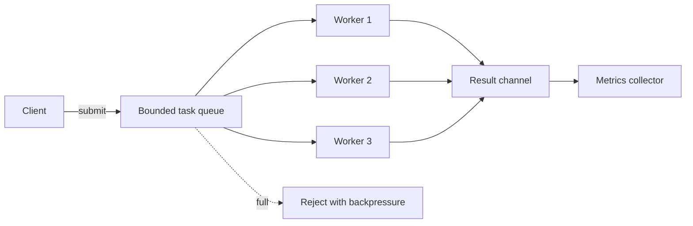

# Architecture

The fixed worker count bounds active concurrency, while queue capacity bounds
waiting work. Results are drained independently so workers do not remain blocked
after task completion.
