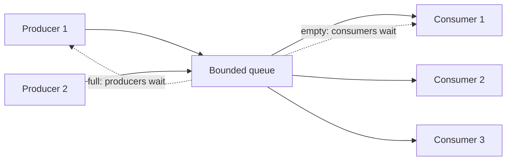

# Architecture

```mermaid
flowchart LR
    P1[Producer 1] --> Queue[Bounded queue]
    P2[Producer 2] --> Queue
    Queue --> C1[Consumer 1]
    Queue --> C2[Consumer 2]
    Queue --> C3[Consumer 3]
    Queue -. full: producers wait .-> P1
    Queue -. empty: consumers wait .-> C1
```

The mutex protects the queue's compound state. Separate condition variables wake
producers when capacity becomes available and consumers when work arrives.
