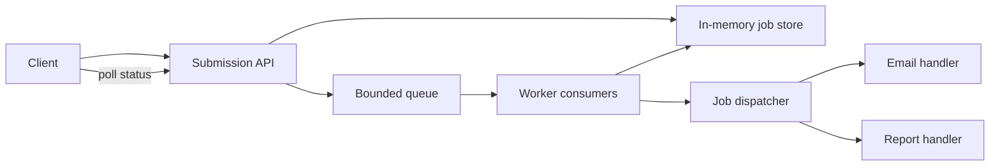

# Architecture

```mermaid
flowchart LR
    Client --> API[Submission API]
    API --> Store[In-memory job store]
    API --> Queue[Bounded queue]
    Queue --> Workers[Worker consumers]
    Workers --> Dispatcher[Job dispatcher]
    Dispatcher --> Email[Email handler]
    Dispatcher --> Report[Report handler]
    Workers --> Store
    Client -->|poll status| API
```

Submission and execution are decoupled, but both the queue and status store are
local to one process. The architecture demonstrates async flow, not durability.
