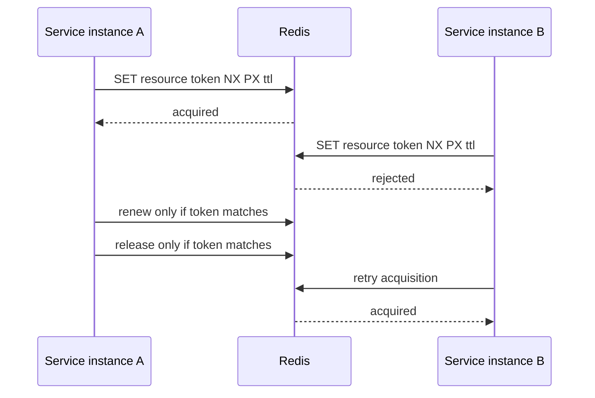

# Architecture

```mermaid
sequenceDiagram
    participant A as Service instance A
    participant R as Redis
    participant B as Service instance B
    A->>R: SET resource token NX PX ttl
    R-->>A: acquired
    B->>R: SET resource token NX PX ttl
    R-->>B: rejected
    A->>R: renew only if token matches
    A->>R: release only if token matches
    B->>R: retry acquisition
    R-->>B: acquired
```

Unique ownership tokens prevent one process from releasing another process's
lease. TTL bounds abandoned-lock lifetime; fencing remains future work.
